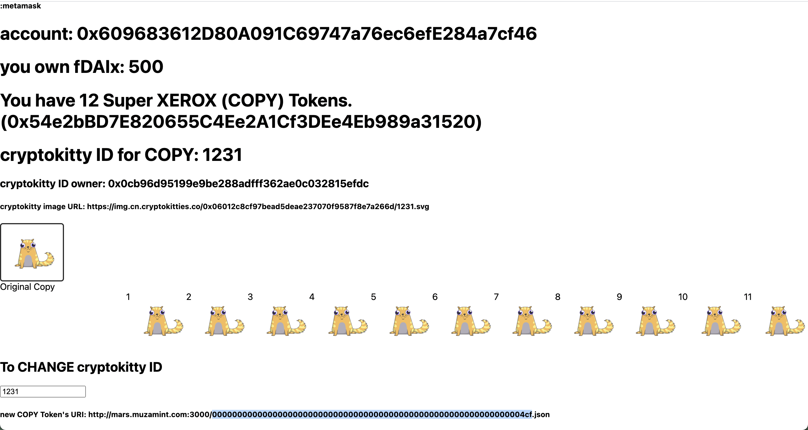

# Super COOL, Super XEROX
You can copy your own NFT (such as CryptoKitties) and share or exchange with your friends.
* You can stream fDAIx supter tokens to 0x68cB5B558F15799920E0D038eF87544e670af503 to pay for the NFT copies.
And you will get same amount of the COPY super tokens in return.
* https://app.superfluid.finance/

# Contract addresses (on Rinkeby)
* Super XEROR (the copy machine) "0x68cB5B558F15799920E0D038eF87544e670af503" 

# Token address (on Rinkeby)
* Your NFT Copies (ERC1155) "0x50C715221c3ca24678ad11B51980bBa1A1599F3e"
```
This token is a copy of your cryptoKitty in ERC1155 format. the balanceOf (address, id) where id is the kitty id.
```
* Your COPY super token (ERC777) "0x54e2bBD7E820655C4Ee2A1Cf3DEe4Eb989a31520"
```
You can receive these COPY tokens as the credit for printing. You can stream fDAIx super token to address 0x68cB5B558F15799920E0D038eF87544e670af503 for exchange with COPY super tokens.
```

# Rules
* You can copy your own NFT tokens ONLY!! 👏  (eventually for any NFT, this version only support CryptoKitties, will support OpenSea or others NFT marketplaces in the future)
* The cost for copy a "Color" NFT is one xDAI or one COPY token.
* You can transfer the copies of your NFT token as you want.  

# Demo ScreenShot



# presentation video

https://youtu.be/CIbI9MI26tk

# Live Demo

Vercel: https://react-app-blush.vercel.app

*🚀 Deployment to IPFS complete!

Use the links below to access your app:
* IPFS: https://ipfs.io/ipfs/QmTHMcK4kFVKexrt59vdiEzKBx4cSRTWzDaQjLGdGNEHb7
* IPNS: https://ipfs.io/ipns/k51qzi5uqu5djaaeue73nfojpvksbaqewifekpynvlzprdb00ebmys469y9dyi

# slide
https://slides.com/ming-derwang/deck-ea6370
